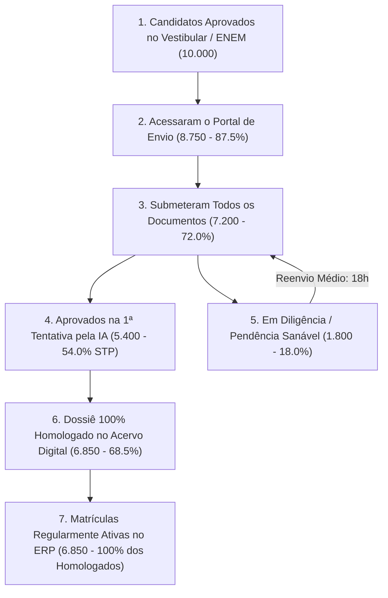
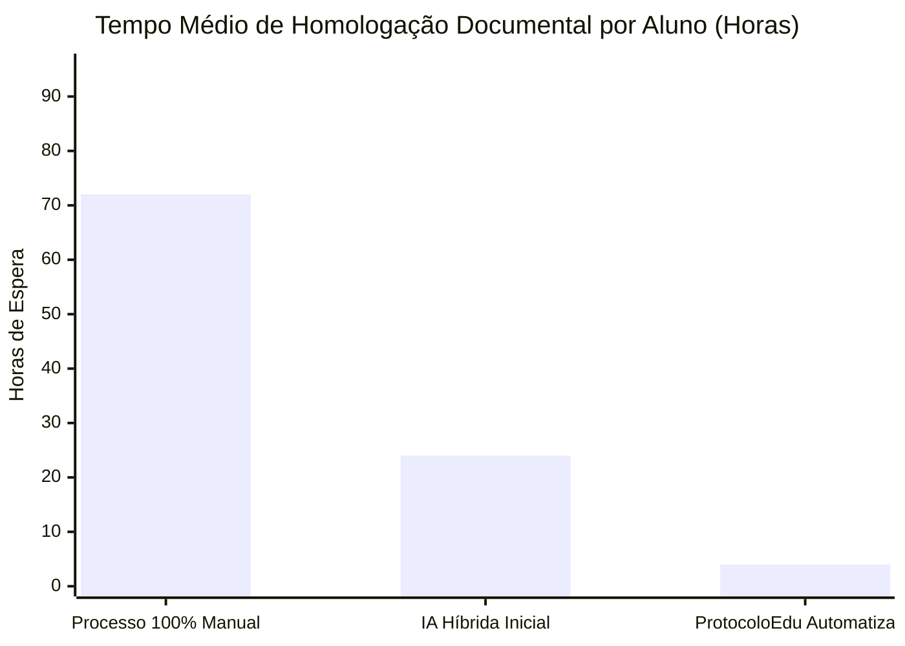

# Generative Analytics Reports

Metodologia analítica e gerador de relatórios executivos de inteligência de negócios voltados para a **Reitoria**, **Pró-Reitorias Acadêmicas**, **Secretarias Gerais** e **Conselho de Mantenedoras**. Transforma logs brutos de auditoria documental e dossiês de alunos em insights acionáveis de conversão, eficiência operacional e segurança regulatória.

---

## 1. Painel de Indicadores Estratégicos (KPI Framework)

Ao compilar relatórios para a alta gestão educacional, monitore e apresente as seguintes métricas fundamentais:

```text
┌────────────────────────────────────────────────────────────────────────┐
│                      MATRIZ DE INDICADORES CRÍTICOS                    │
├───────────────────────────────┬────────────────────────────────────────┤
│ MCR (Matriculation Conversion)│ % de candidatos que completaram 100%   │
│                               │ do dossiê e efetivaram a matrícula.    │
├───────────────────────────────┼────────────────────────────────────────┤
│ STP (Straight-Through Proc.)  │ % de documentos aprovados imediatamente│
│                               │ pela IA sem intervenção humana manual. │
├───────────────────────────────┼────────────────────────────────────────┤
│ TAT (Turnaround Time)         │ Tempo médio (em horas) entre a rejeição│
│                               │ do documento e o reenvio pelo discente.│
├───────────────────────────────┼────────────────────────────────────────┤
│ BDR (Bottleneck Document Rate)│ Ranqueamento dos documentos que mais   │
│                               │ causam reprovação e atraso no funil.   │
├───────────────────────────────┼────────────────────────────────────────┤
│ Compliance Index (MEC 315)    │ % de arquivos no Acervo Digital com    │
│                               │ metadados CONARQ e hash SHA-256 válidos│
└───────────────────────────────┴────────────────────────────────────────┘
```

---

## 2. Metodologia do Funil de Conversão Documental

O funil divide a jornada de matrícula do estudante em etapas bem definidas, permitindo identificar exatamente onde ocorre a evasão prematura:



---

## 3. Matriz de Diagnóstico de Gargalos (Top Ofensores)

O relatório executivo deve detalhar as causas de reprovação para orientar melhorias na comunicação institucional:

| Documento Crítico | Taxa de Rejeição | Motivo Principal Identificado pela IA | Ação Corretiva Recomendada |
| :--- | :--- | :--- | :--- |
| **Histórico do Ensino Médio** | 38.4% | Ausência de carimbo legível da secretaria escolar ou falta do verso com carga horária. | Inserir alerta ilustrado no portal: *"Certifique-se de fotografar a folha com as notas e o carimbo com a assinatura do diretor."* |
| **Certidão de Registro Civil** | 22.1% | Divergência de sobrenome em relação ao RG/Histórico sem a respectiva averbação de casamento. | Condicionar o formulário: *"Seu nome mudou após o casamento ou divórcio? Envie a certidão com a anotação/averbação averbada."* |
| **RG / CIN** | 18.5% | Envio exclusivo da frente (sem verso) ou corte de bordas com perda do dígito verificador. | Implementar validador de imagem no cliente (mobile) com aviso de *"Verso obrigatório"*. |
| **Diploma de Graduação** | 14.2% | Envio de atestado provisório vencido ou diploma digital sem o código validador legível. | Adicionar aviso explícito na 2ª Graduação sobre o prazo de validade de declarações de colação de grau. |

---

## 4. Eficiência Operacional: IA vs Secretaria Acadêmica

Apresentar a evolução de produtividade alcançada com o ProtocoloEdu:



### Análise de Retorno sobre Investimento (ROI)
- **Redução de Custo de Back-Office**: Queda de 75% no tempo gasto por funcionários da secretaria acadêmica na checagem manual de dados cadastrais (CPF, RG, filiação).
- **Aceleração da Matrícula**: Redução do tempo médio de análise de 72 horas para menos de 4 horas, mitigando a evasão de candidatos que recebem ofertas concorrentes de outras IES.
- **Segurança Jurídica**: 100% dos dossiês passam por checagem de conformidade com a Portaria MEC nº 315/2018, eliminando o passivo de notificações em avaliações do MEC/INEP.

---

## 5. Template Canônico do Relatório Executivo para a Reitoria

Ao gerar relatórios periódicos, adote a seguinte estrutura formal:

````markdown
# Relatório Executivo de Auditoria e Conversão de Matrículas
**Instituição**: Faculdade IMES / Mantenedora Educar  
**Período de Referência**: 2026.1 (Admissões Vestibular & Transferências)  
**Data de Emissão**: 25/09/2026  
**Auditor Responsável**: Sistema ProtocoloEdu (Compliance MEC 315/2018)

---

## 1. Resumo Executivo e Destaques
- **Total de Ingressantes Avaliados**: 3.420 candidatos.
- **Dossiês Concluídos (Homologados)**: 2.940 (86,0% de taxa de conversão final).
- **Índice de Aprovação Direta pela IA (STP)**: 74,2% das submissões aprovadas sem triagem manual.
- **Casos com Suspeita de Fraude Encaminhados à Perícia**: 11 documentos (0,32%).

---

## 2. Desempenho por Unidade / Polo Educacional

| Campus / Polo | Candidatos | Dossiês Homologados | Pendências Ativas | Tempo Médio Resolução (TAT) |
| :--- | :--- | :--- | :--- | :--- |
| Campus Central (Presencial) | 1.850 | 1.628 (88,0%) | 222 | 14,2 horas |
| Polo Digital 01 - SP | 920 | 791 (86,0%) | 129 | 19,5 horas |
| Polo Digital 02 - RJ | 650 | 521 (80,1%) | 129 | 26,4 horas |

---

## 3. Principais Gargalos Documentais
- **Gargalo #1**: Históricos do Ensino Médio de outros estados com visto de inspeção ilegível (32% das reprovações).
- **Gargalo #2**: Certidões sem averbação de casamento quando há alteração patronímica (24% das reprovações).

---

## 4. Recomendações Estratégicas para o Próximo Ciclo
1. **Campanha Preventiva de Matrícula**: Disparar e-mail e WhatsApp automático 2 horas após a aprovação no vestibular orientando o candidato a providenciar o Histórico Escolar do Ensino Médio com ambas as faces.
2. **Capacitação da Secretaria**: Manter foco da equipe humana nas exceções sinalizadas como Faixa Amarela pela IA, garantindo retorno ao aluno em menos de 12 horas.
3. **Custódia Digital Automatizada**: Prosseguir com a emissão em lote de hashes SHA-256 e integração direta com o ERP TOTVS/Solis para todos os 2.940 alunos homologados.
````
